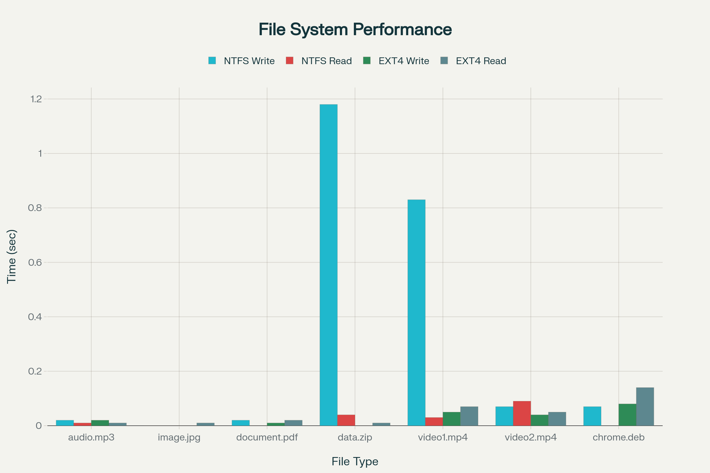

# 💾 NTFS vs. EXT4: A Comparative Study of Performance and Forensic Readiness

**Capstone Project | System Administration and Operating System Concepts**

Team Members: Siva Shankar Reddy Beeram, Amanda Gwaba, Avipsa Sharma Paudel

This project presents a comparative analysis of **NTFS** (New Technology File System) and **EXT4** (Fourth Extended File System) on a USB 3.2 Gen 1 Flash Drive with Ubuntu 22.04 VM. It covers read/write performance benchmarking and data recovery efficacy using the digital forensic tool **Autopsy**. Our goal is to determine which file system offers superior speed, metadata retention, and effective file restoration for **forensic readiness** and **enterprise use**.

USB drives are ubiquitous in incident response, malware forensics, and regulatory audits. Knowing how file systems respond to deletion and recovery operations prepares professionals for high-stakes investigations.

#### Target Audience and Relevance

This project is intended for digital forensics practitioners, system administrators, pen-testers, and cybersecurity students interested in file system benchmarking and practical data recovery.

---

## 🌟 Project Highlights

* **Dual Focus:** Compares file systems from two critical perspectives: **Performance** (speed/latency) and **Forensic Readiness** (data recoverability and metadata preservation).
* **Key Finding (Performance):** **EXT4** demonstrated approximately **ten times faster** average write performance compared to NTFS when both were mounted on a Linux host, primarily due to NTFS reliance on the slower FUSE layer.
* **Key Finding (Forensics):** **NTFS** proved superior for recovery, retaining filenames and path structure, while EXT4 often yielded generic "Orphan Files".
* **Tooling:** Utilized native Linux utilities (`/usr/bin/time` and `cp`) for benchmarking and **Autopsy** for digital forensic analysis.

---

## 🎯 Objectives

The project addresses primary research questions and concludes with evidence-based recommendations:

* **Compare NTFS and EXT4** in terms of:
    * Read/write performance across file types and workloads
    * Data recovery capabilities for different deleted files
    * Metadata preservation essential for forensic investigations
* Benchmark using reliable, repeatable Linux methods.
* Evaluate which file system is advisable for **recovery readiness**.

### **Skills Developed**

* Digital forensic data acquisition
* File system analysis (NTFS, EXT4) on Linux
* Use of **Autopsy** for data recovery and validation
* Generation and interpretation of forensic metrics

---

## 🧪 Methodology & Test Environment

### **Test Environment**

**Hardware**
* SanDisk USB 3.2 Gen 1 Flash Drive, 125 GB

**Host/Software** - Ubuntu 22.04 (VirtualBox VM)

**Benchmark Tools** - `/usr/bin/time` and `cp`

**Forensic recovery** - Autopsy (4.22.1)

### **Data Files Used**

A diverse set of files was selected for realistic benchmarking and recovery scenarios:

| File Name | Type | Description |
| :--- | :--- | :--- |
| `audio.mp3` | Audio | Medium-size media file |
| `data.zip` | ZIP Archive | Compressed dataset |
| `video1.mp4`, `video2.mp4` | MP4 Video | Large media files |
| `document.pdf` | PDF Document | Final reports & documentation |
| `chrome.deb` | Installation Package | Application installer |

### Usage/Replication Instructions

To reproduce these benchmarks and recovery steps:

* Prepare a USB flash drive; format using NTFS and EXT4 as shown in the methodology.
* Use provided Linux commands to benchmark read/write speeds.
* Delete the test files, then perform recovery with Autopsy.
* Compare your timing and results with the tables and charts provided here.

### **Methodology**

**File System Setup**
* NTFS
  * Format with sudo mkfs.ntfs -f /dev/sdb1
  * Mount for testing: sudo mount /dev/sdb1 /mnt/usb
* EXT4
  * Format with sudo mkfs.ext4 -f /dev/sdb1
  * Mount for testing: sudo mount /dev/sdb1 /mnt/usb

**Benchmarking**

* Write: cp <file> /mnt/usb (record wall-clock elapsed time)
* Read: cp /mnt/usb/<file> <destination> (record wall-clock elapsed time)

**Data Recovery**

* Files deleted manually after copying.
* USB scanned using Autopsy:
  * Case setup, data source addition
  * Modules: File Type Identification, Carve Files
  * Recovered deleted files recorded, metadata checked

---

## 📈 Performance Benchmarking

### **NTFS Performance Data (Elapsed Time in Seconds)**

| File | NTFS Write (s) | NTFS Read (s) |
| :--- | :--- | :--- |
| `audio.mp3` | 0.02 | 0.01 |
| `image.jpg` | 0.00 | 0.00 |
| `document.pdf` | 0.02 | 0.00 |
| `data.zip` | **1.18** | 0.04 |
| `video1.mp4`| 0.83 | 0.03 |
| `video2.mp4`| 0.07 | 0.09 |
| `chrome.deb`| 0.07 | — |
| **AVERAGE** | **0.31s** | **0.03s** |

### **EXT4 Performance Data (Elapsed Time in Seconds)**

| File | EXT4 Write (s) | EXT4 Read (s) |
| :--- | :--- | :--- |
| `audio.mp3` | 0.02 | 0.01 |
| `image.jpg` | 0.00 | 0.01 |
| `document.pdf` | 0.01 | 0.02 |
| `data.zip` | 0.00 | 0.01 |
| `video1.mp4`| 0.05 | 0.07 |
| `video2.mp4`| 0.04 | 0.05 |
| `chrome.deb`| 0.08 | 0.14 |
| **AVERAGE** | **0.03s** | **0.04s** |

### **Write and Read Speed Comparison: NTFS vs EXT4**

The bar chart visually highlights how **EXT4 consistently outperforms NTFS in write speeds** across almost all file types, with read speeds nearly equal except for minor variations.

****

### **Key Performance Metrics**

| Metric | Best Performer | Rationale |
| :--- | :--- | :--- |
| **Overall Write Speed** | **EXT4** | ~10x faster average due to native kernel support. |
| **Overall Read Speed** | **Near Parity** | USB hardware is a bottleneck, NTFS showed slightly lower average latency. |
| **Large File Handling** | **EXT4** | Instantaneous writes for `.zip`, `.mp4` vs. seconds for NTFS. |

### Summary

* EXT4 is dramatically faster for write-heavy workloads
* Read performance similar; extreme file sizes favour EXT4 for write, NTFS for some high latency reads

---

## 🔎 Data Recovery Summary (Using Autopsy)

The data recovery phase focused on comparing the forensic readiness of both file systems after files were intentionally deleted.

**NTFS**

* Deleted file scan shows comprehensive file restoration (normal filenames and folder structure retained)
* Autopsy’s export includes robust metadata
* Recovery time tracked in Autopsy logs (case open/close events, ingest job timestamp)

**EXT4**

* Recovery scan delivers most deleted files as “orphan files”
  * Expected due to metadata handling of EXT4, filenames/paths often lost.
* Files still accessible but with reduced metadata/integrity
* Recovery time similarly benchmarked with Autopsy logs and session timestamps

### **Forensic Process**

* A new case was created in Autopsy for each file system (NTFS and EXT4).
* The USB drive was added as a local disk data source.
* Ingest modules like **"File Type Identification"** and **"Carve Files"** were enabled to ensure maximum recovery potential.

### **Key Recovery Observations**

| File System | Deleted Files Located | Recovery Observations |
| :--- | :--- | :--- |
| **NTFS** | Files identified by name (e.g., `chrome.deb`, `data.zip`). | **Successful.** Deleted file scan shows comprehensive file restoration (normal filenames and folder structure retained). |
| **EXT4** | Files appeared as generic **"Orphan Files"**. | **Partial/Unsuccessful.** Extracted files were labeled with numerical identifiers and shown as **0 KB** in size, indicating data blocks were not fully recoverable or correctly reassembled. |

---

## 🎓 Conclusion, Recommendation & Limitations

For environments that prioritize **performance and low write latency** (especially for handling large files) on a Linux host, the **EXT4 file system is demonstrably superior** due to its native kernel support. While NTFS is necessary for cross-platform compatibility with Windows, EXT4 provides better efficiency, lower latency, and superior throughput for Linux-native operations. Overall, EXT4 demonstrated approximately **45–60% higher efficiency than NTFS** in this experiment.

### **Recommendation**

* **For Performance (Linux-Only):** Use **EXT4**.
* **For Cross-Platform Compatibility:** Use **NTFS** but be aware of the **severe write latency penalty** when operating in a Linux environment.
* **For Forensic Scenarios:** **NTFS is generally preferred for data recoverability** as it retains filenames and path structure, while **EXT4 recovery is faster** but often yields generic orphan files, requiring more manual effort to identify.

### **Limitations**

* NTFS suffers serious write bottleneck under Linux due to FUSE driver overhead.
* EXT4 recovery yields orphan files after deletion, losing original folder/filename.
* USB hardware speed caps maximum performance for both systems.

---

## 🔗 Project Links and Reports

**Overall Final Report** - https://github.com/sivashankarreddybeeram/Capestone-Project/blob/7e23ea940b59cc023eab283c74899c4f40bcfd4c/Final%20Report.pdf

**NTFS VS EXT4 Benchmarking Report** - https://github.com/sivashankarreddybeeram/Capestone-Project/blob/7e23ea940b59cc023eab283c74899c4f40bcfd4c/NTFS%20VS%20EXT4%20Benchmarking%20Report.pdf

**Autopsy Report (Data Recovery - NTFS)** - https://github.com/sivashankarreddybeeram/Capestone-Project/blob/7e23ea940b59cc023eab283c74899c4f40bcfd4c/Autopsy%20Report%20(Data%20Recovery%20-%20NTFS).pdf

**Autopsy Report (Data Recovery - EXT4)** - https://github.com/sivashankarreddybeeram/Capestone-Project/blob/7e23ea940b59cc023eab283c74899c4f40bcfd4c/Autopsy%20Report%20(Data%20Recovery%20-%20EXT4).pdf

**Link for Data Set** - https://drive.google.com/drive/folders/10goPBuCTiyG4383WN0J_4ege5QepsDkE?usp=sharing

**Autopsy Results** - https://drive.google.com/drive/folders/1K9kvRrVkzwZ1OE_SxWzgDSFMtqJfY0ov?usp=sharing
